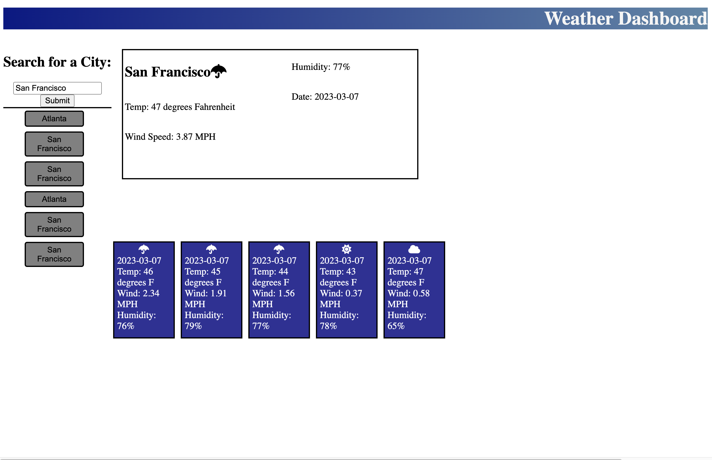

# Weather-Reporter
- Started by putting together some basic HTML and CSS
- A bit ugly, but mainly I wanted to focus on the JavaScript
- After I had the page put together properly, I began by fetching the weather API that we were instructed to use.
- This did not immediately work, and unless I put in latitudes and longitudes I did not get the results I wanted.
- I added a second api, this one for the same website's geocoder to transform a city name into a set of coordinates, which eventually got my api to succesfully find and search for city weather patterns
- Afterwards I went into each individual day and got the desired information to display
- I also used an icon library to get my icons for displaying the weather
- One hiccup was with the temperature being in kelvin, and the math wasn't adding up until I properly formatted it so the order of operations would work correctly
- Once this was all done, I played around with the search history, and after getting some assistance, turned the local storage into a string and was able to retrieve that information for previous searches and to then click those searches for updated info.

Website URL:https://alphastranger.github.io/Weather-Reporter/

